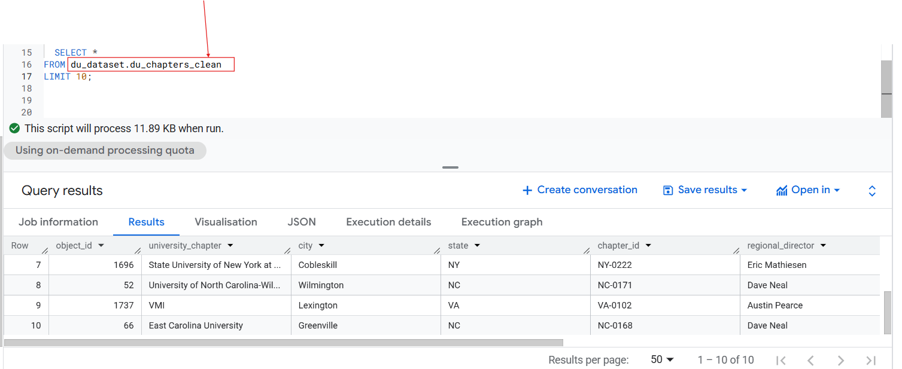

# University Chapters ETL Project

## Project Description
This project demonstrates an ETL process using Google BigQuery.
Data was extracted from an ArcGIS REST API,
transformed using SQL, and loaded into a clean analytics-ready table.

## SQL File
The transformation query is saved as:

du_chapters_etl.sql

## Screenshots

### SQL Query

### Raw Data

### Clean Data

